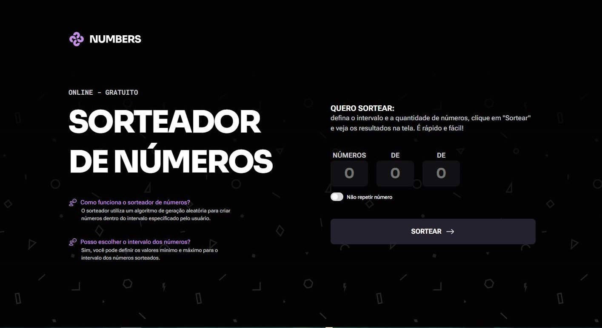
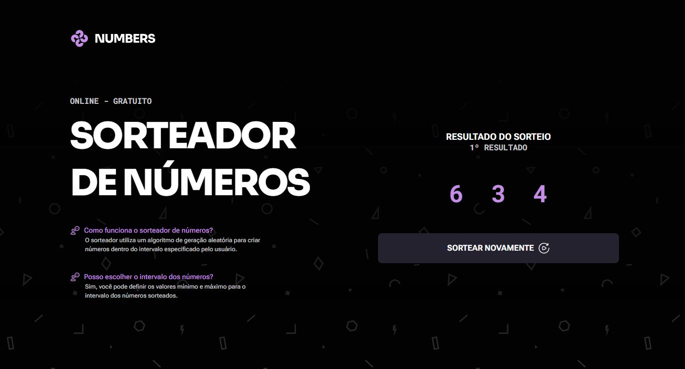

# Desafio prático - Sorteador

Desenvolvendo uma aplicação de um sorteador de números onde o usuário seleciona quantos números quer sortear.
## Nessa aplicação é possivel:

- O usuário pode digitar quantos números quer sortear em um primeiro campo;
- O usuário pode escolher um intervalo entre dois números para esse sorteio;
- Ao sortear os números devem aparecer, um por um, de maneira animada na tela.

### Trabalhando com:

- Conceitos intermediários de JS;
- Animações;
- Funções;
- Eventos;

## Referência

Esse é um dos desafio da formação Full-Stack, um dos conteúdos disponíveis para alunos da Rocketseat.

 - [Sorteador de números - Rocketseat](https://www.figma.com/community/file/1397279380752780744)
## Screenshots

